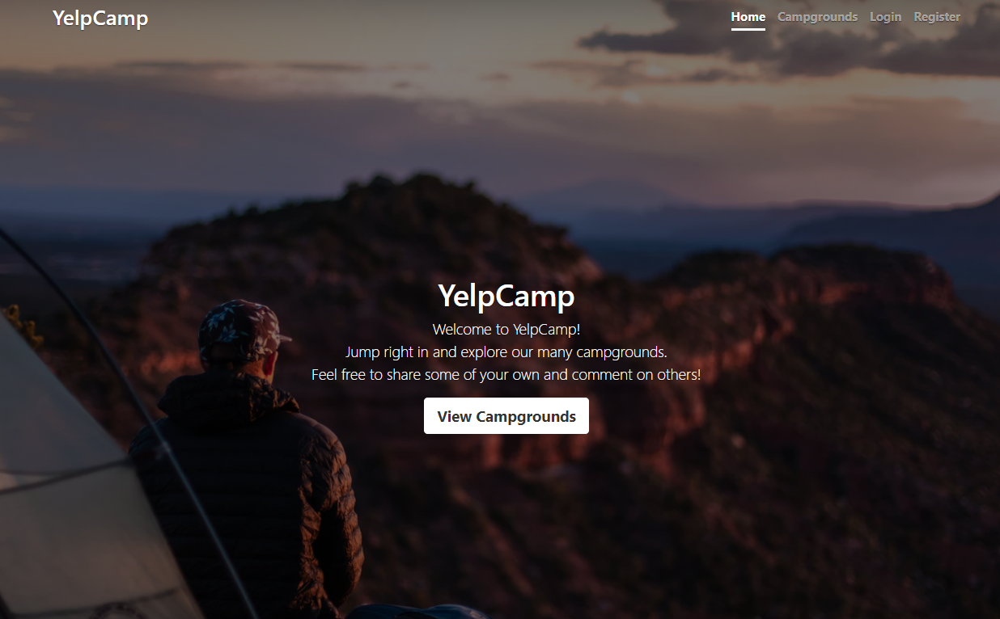

 <h1 align="center">Yelp Camp v0.2</h1>

  <p align="center">
    Node.js web application build while learning from this <a href="https://www.udemy.com/course/the-web-developer-bootcamp">web dev course</a>.
    <br>
    App uses REST api and have many features like <a href='http://www.passportjs.org/'>Passport JS</a> authentication, <a href='https://www.mapbox.com/'>Mapbox</a> tools for data visualization and <a href='https://cloudinary.com/'>Cloudinary</a> for image upload and storage.
    <br>
  </p>
  <br/>  <br/>

<!-- ABOUT THE PROJECT -->

<h1 align="center">About the app</h1>
<p align="center">
    
</p>

<br/> <br/>

## Built With

- HTML5
- CSS
- [Javascript](https:nodejs.com)
- [Express](https://expressjs.com/)
- [MongoDB](https://www.mongodb.com/)

<!-- GETTING STARTED -->

## Getting Started

To get a local copy up and running follow these simple steps.

### Installation

1. Clone the repo
   ```sh
   git clone https://github.com/genadi53/YelpCamp_v2
   ```
2. Install NPM packages
   ```sh
   npm install
   ```
3. Run the app
   ```sh
    npm start
   ```
   Open [http://localhost:3000](http://localhost:3000) to view it in the browser.
